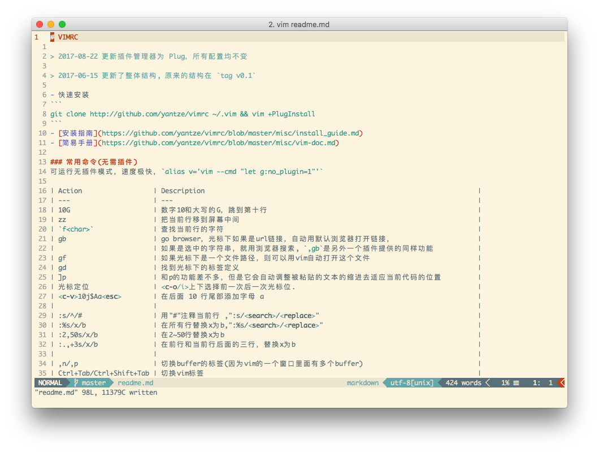
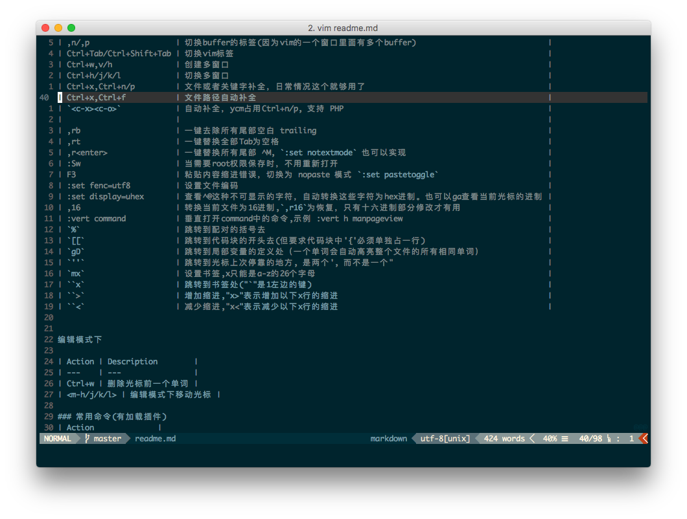

# VIMRC

> 2017-08-22 更新插件管理器为 Plug，所有配置均不变

> 2017-06-15 更新了整体结构, 原来的结构在 `tag v0.1`

- 快速安装
```
git clone http://github.com/yantze/vimrc ~/.vim && vim +PlugInstall
```

- NeoVim 安装
```
git clone http://github.com/yantze/vimrc ~/.vim
ln -s ~/.vim ~/.config/nvim
nvim +PlugInstall
```

- Windows 安装
```
git clone http://github.com/yantze/vimrc C:\Users\Uesr\vimfiles
gvim +PlugInstall
```

- [安装指南](./misc/install_guide.md)
- [简易手册](./misc/vim-doc.md)

## 截屏
> 皆在终端展示，对于 macvim、gvim 等已做适配

- 目前使用的主题 solarized light

- 也可以使用黑色的主题，使用 [pt_black](https://github.com/yantze/pt_black)


### 常用命令(无需插件)
可运行无插件模式，速度极快，`alias v='vim --cmd "let g:no_vimrc_bundles=1"'`

| Action                  | Description                                                                     |
| ----------------------- | ------------------------------------------------------------------------------- |
| ,rsl                    | 用 $SHELL 执行当前选定行, run select line                                       |
| ,rso                    | 用 $SHELL 执行当前选定行, 并把输出替换选定内容                                  |
| :Sw                     | 当需要root权限保存时，不用重新打开                                              |
| 10G                     | 数字10和大写的G，跳到第十行                                                     |
| zz                      | 把当前行移到屏幕中间                                                            |
| `f<char>`               | 查找当前行的字符                                                                |
| gb                      | go browser，光标下如果是url链接，自动用默认浏览器打开链接，                     |
|                         | 如果是选中的字符串，就用浏览器搜索, `,gb`是另外一个插件提供的同样功能           |
| gf                      | 如果光标下是一个文件路径，则可以用vim自动打开这个文件                           |
| gd                      | 找到光标下的标签定义                                                            |
| ]p                      | 和p的功能差不多，但是它会自动调整被粘贴的文本的缩进去适应当前代码的位置         |
| jumplist                | <c-o/i>上下选择前一次后一次光标位.                                              |
| <c-v>10j$Aa<esc>        | 在后面 10 行尾部添加字母 a                                                      |
|                         |                                                                                 |
| :s/^/#                  | 用"#"注释当前行 ,":s/<search>/<replace>"                                        |
| :%s/x/b                 | 在所有行替换x为b,":%s/<search>/<replace>"                                       |
| :2,50s/x/b              | 在2~50行替换x为b                                                                |
| :.,+3s/x/b              | 在前行和当前行后面的三行，替换x为b                                              |
|                         |                                                                                 |
| ,n/,p                   | 切换buffer的标签(因为vim的一个窗口里面有多个buffer)                             |
| Ctrl+Tab/Ctrl+Shift+Tab | 切换vim标签                                                                     |
| Ctrl+w,v/h              | 创建多窗口                                                                      |
| Ctrl+h/j/k/l            | 切换多窗口                                                                      |
| Ctrl+x,Ctrl+n/p         | 文件或者关键字补全，日常情况这个就够用了                                        |
| Ctrl+x,Ctrl+f           | 文件路径自动补全                                                                |
| `<c-x><c-o>`            | 自动补全，ycm占用Ctrl+n/p, 支持 PHP                                             |
|                         |                                                                                 |
| ,rb                     | 一键去除所有尾部空白 trailing                                                   |
| ,rt                     | 一键替换全部Tab为空格                                                           |
| ,r<enter>               | 一键替换所有尾部 ^M, `:set notextmode` 也可以实现                               |
| F3                      | 粘贴内容缩进错误，切换为 nopaste 模式 `:set pastetoggle`                        |
| :set fenc=utf8          | 设置文件编码                                                                    |
| :set display=uhex       | 查看^@这种不可显示的字符，自动转换这些字符为hex进制。也可以ga查看当前光标的进制 |
| ,16                     | 转换当前文件为16进制,`,r16`为恢复，只有十六进制部分修改才有用                   |
| :vert command           | 垂直打开command中的命令,示例 :vert h manpageview                                |
| `%`                     | 跳转到配对的括号去                                                              |
| `[[`                    | 跳转到代码块的开头去(但要求代码块中'{'必须单独占一行)                           |
| `gD`                    | 跳转到局部变量的定义处（一个单词会自动高亮整个文件的所有相同单词）              |
| `''`                    | 跳转到光标上次停靠的地方, 是两个', 而不是一个"                                  |
| `mx`                    | 设置书签,x只能是a-z的26个字母                                                   |
| ``>`                    | 增加缩进,"x>"表示增加以下x行的缩进                                              |
| ``<`                    | 减少缩进,"x<"表示减少以下x行的缩进                                              |
| ``x`                    | 跳转到书签处("`"是1左边的键) |


编辑模式下

| Action      | Description        |
| ----------- | ------------------ |
| Ctrl+w      | 删除光标前一个单词 |
| <m-h/j/k/l> | 编辑模式下移动光标 |

### 常用命令(有加载插件)
| Action                | Description                                                                                                                                                                                                                  |
| --------------------- | ---------------------------------------------------------------------------------------------------------------------------------------------------------------------------------------------------------------------------- |
| `<c-p>`               | 快速查找当前文件夹下所有子目录的文件,ctrl+j/k上下选择文件                                                                                                                                                                    |
| :ag                   | 查找当前目录下的所有文件的关键字                                                                                                                                                                                             |
| ,ci                   | 注释当前行或选定行(自动识别文件类型后添加注释)                                                                                                             f                                                                 |
| ,cm                   | 块注释(可选中)                                                                                                                                                                                                               |
| `<c-n><c-j/k>`        | 用<c-n>当前选中的行，用<c-j/k>来移动行的位置(vim-multipe-cursors)                                                                                                                                                            |
| `<m-j/k>`             | 用alt/command+j/k移动当前行的位置(功能同上)                                                                                                                                                                                  |
| `<c-n>`               | 不停的选中<c-n>,可以执行多光标编辑 , <c-p>回到前一个,<c-x>放弃当前这个光标到下一个 , 其中i,a,I,A可以在insert模式，c,s可以在normal模式，c是清除当前选中的文字 , 有个小bug,就是在多光标选中模式下，要先按i或者a这个键，再按I/A |
| ,mt                   | 生成每个语言的ctags文件，可以通过ctrl+]跳转和ctrl+t返回                                                                                                                                                                      |
| +/-                   | +可以扩大选择区域/-相反                                                                                                                                                                                                      |
| `,bb /,bn<type char>` | 按等于号对其或者自定义符号对齐                                                                                                                                                                                               |
| :DiffSaved            | 比较在保存文件之后修改了什么那些内容                                                                                                                                                                                         |
| :Man glob             | 查看linux关于glob的man文档(only linux/mac)                                                                                                                                                                                   |
| :Man glob.php         | 查看从php.net中访问glob的相关语法和示例(only linux/mac)                                                                                                                                                                      |
| K                     | 判断文件类型，自动调用:Man function/command name，在Man中查光标所在处的词                                                                                                                                                    |


### 关于自动补全
本配置自动补全有三个部分:
- [vim-snippets](https://github.com/honza/vim-snippets) , 常见snippets 都有，根据文件类型和语法补全，同时可以在 `~/.vim/snippets` 中自行添加

### 衍生 vim
macvim
```
mvim 可以支持 gview、gvim、gvimdiff、mvim、mvimdiff、mview 等命令
```

### Thanks
[ruchee's vimrc](https://github.com/ruchee/vimrc)

